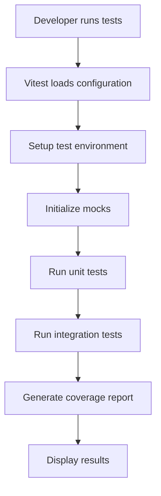
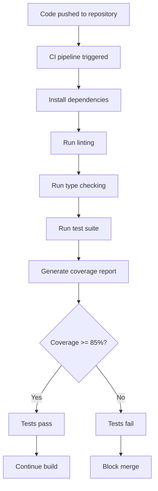

# Design Document

## Overview

The comprehensive testing framework will establish a robust testing infrastructure for the Kiro Steering Loader VS Code extension using modern TypeScript testing tools. The design follows a layered testing approach with unit tests, integration tests, and end-to-end tests, ensuring high code coverage while maintaining type safety throughout the testing process.

## Architecture

### Testing Framework Stack

- **Test Runner**: Vitest (modern, fast, TypeScript-first test runner)
- **Assertion Library**: Vitest built-in assertions with custom VS Code matchers
- **Mocking**: Vitest mocking capabilities with custom VS Code API mocks
- **Coverage**: c8 (V8 coverage) integrated with Vitest
- **E2E Testing**: @vscode/test-electron for VS Code extension testing
- **Type Testing**: Custom type assertion utilities

### Directory Structure

```
tests/
├── unit/                           # Unit tests
│   ├── extension.test.ts          # Extension activation tests
│   ├── steeringTemplateProvider.test.ts  # Provider unit tests
│   └── templateItem.test.ts       # TemplateItem class tests
├── integration/                    # Integration tests
│   ├── commands.test.ts           # Command integration tests
│   ├── configuration.test.ts     # Configuration integration tests
│   └── treeDataProvider.test.ts  # Tree provider integration tests
├── e2e/                           # End-to-end tests
│   ├── templateLoading.test.ts    # Complete workflow tests
│   ├── errorHandling.test.ts      # Error scenario tests
│   └── userInteraction.test.ts    # User interaction tests
├── fixtures/                      # Test data and fixtures
│   ├── templates/                 # Sample template files
│   └── workspaces/               # Test workspace configurations
├── mocks/                         # Mock implementations
│   ├── vscode.ts                 # VS Code API mocks
│   ├── fs.ts                     # File system mocks
│   └── path.ts                   # Path utility mocks
└── utils/                         # Test utilities
    ├── testHelpers.ts            # Common test utilities
    ├── typeAssertions.ts         # Type-safe assertion helpers
    └── fixtures.ts               # Test data factories
```

## Components and Interfaces

### Test Configuration

```typescript
// vitest.config.ts
interface TestConfig {
  testEnvironment: 'node';
  coverage: CoverageConfig;
  setupFiles: string[];
  testMatch: string[];
}

interface CoverageConfig {
  provider: 'c8';
  reporter: ['text', 'html', 'json', 'lcov'];
  threshold: {
    lines: 85;
    functions: 85;
    branches: 85;
    statements: 85;
  };
  exclude: string[];
}
```

### Mock Interfaces

```typescript
// VS Code API Mock Interface
interface VSCodeMock {
  window: {
    showInformationMessage: Mock;
    showErrorMessage: Mock;
    showOpenDialog: Mock;
    registerTreeDataProvider: Mock;
  };
  commands: {
    registerCommand: Mock;
  };
  workspace: {
    getConfiguration: Mock;
    workspaceFolders: WorkspaceFolder[] | undefined;
  };
  EventEmitter: MockConstructor;
  TreeItem: MockConstructor;
  ThemeIcon: MockConstructor;
}

// File System Mock Interface
interface FileSystemMock {
  existsSync: Mock<[string], boolean>;
  readdirSync: Mock<[string], string[]>;
  readFileSync: Mock<[string, string], string>;
  writeFileSync: Mock<[string, string], void>;
  mkdirSync: Mock<[string, { recursive: boolean }], void>;
}
```

### Test Utilities

```typescript
// Test Helper Interface
interface TestHelpers {
  createMockExtensionContext(): vscode.ExtensionContext;
  createMockWorkspaceFolder(path: string): vscode.WorkspaceFolder;
  createMockConfiguration(values: Record<string, any>): vscode.WorkspaceConfiguration;
  createTempDirectory(): string;
  cleanupTempDirectory(path: string): void;
  createTemplateFile(path: string, content: string): void;
}

// Type Assertion Interface
interface TypeAssertions {
  assertType<T>(value: unknown): asserts value is T;
  expectType<T>(value: T): T;
  assertInstanceOf<T>(value: unknown, constructor: new (...args: any[]) => T): asserts value is T;
}
```

## Data Models

### Test Fixtures

```typescript
// Template Test Data
interface TemplateFixture {
  name: string;
  content: string;
  path: string;
  expectedTreeItem: {
    label: string;
    collapsibleState: vscode.TreeItemCollapsibleState;
    itemType: 'template' | 'info' | 'error' | 'setup';
  };
}

// Workspace Test Data
interface WorkspaceFixture {
  name: string;
  path: string;
  hasKiroDirectory: boolean;
  hasSteeringDirectory: boolean;
  existingTemplates: string[];
}

// Configuration Test Data
interface ConfigurationFixture {
  templatesPath: string | undefined;
  expectedBehavior: 'success' | 'error' | 'setup';
  expectedItems: TemplateItem[];
}
```

## Error Handling

### Test Error Categories

1. **Mock Setup Errors**: Errors in test setup and mock configuration
2. **Assertion Failures**: Test assertion failures with detailed error messages
3. **Async Operation Errors**: Proper handling of Promise rejections in tests
4. **File System Errors**: Mocked file system operation failures
5. **VS Code API Errors**: Simulated VS Code API failures

### Error Handling Strategy

```typescript
// Custom Test Error Classes
class TestSetupError extends Error {
  constructor(message: string, public readonly context: Record<string, any>) {
    super(message);
    this.name = 'TestSetupError';
  }
}

class MockConfigurationError extends Error {
  constructor(message: string, public readonly mockName: string) {
    super(message);
    this.name = 'MockConfigurationError';
  }
}

// Error Assertion Helpers
interface ErrorAssertions {
  expectError<T extends Error>(
    fn: () => Promise<any> | any,
    errorType: new (...args: any[]) => T
  ): Promise<T>;
  expectNoError(fn: () => Promise<any> | any): Promise<void>;
  expectErrorMessage(fn: () => Promise<any> | any, message: string): Promise<void>;
}
```

## Testing Strategy

### Unit Testing Approach

1. **Isolated Component Testing**: Each class and function tested in isolation
2. **Mock Dependencies**: All external dependencies mocked for predictable behavior
3. **Edge Case Coverage**: Comprehensive testing of edge cases and error conditions
4. **Type Safety**: All tests maintain TypeScript type safety

### Integration Testing Approach

1. **Command Integration**: Test command registration and execution flow
2. **Configuration Integration**: Test configuration changes and their effects
3. **VS Code API Integration**: Test interactions with VS Code APIs
4. **File System Integration**: Test file operations with mocked file system

### End-to-End Testing Approach

1. **Complete Workflows**: Test entire user workflows from start to finish
2. **Real VS Code Environment**: Use @vscode/test-electron for realistic testing
3. **User Interaction Simulation**: Simulate actual user interactions
4. **Error Scenario Testing**: Test error handling in realistic scenarios

### Performance Testing Strategy

1. **Activation Time Measurement**: Measure extension activation performance
2. **Memory Usage Monitoring**: Track memory usage during operations
3. **Large Dataset Testing**: Test performance with large numbers of templates
4. **Repeated Operation Testing**: Verify performance stability over time

## Test Execution Flow

### Development Testing



### CI/CD Testing



## Configuration Management

### Test Configuration Files

1. **vitest.config.ts**: Main test configuration
2. **test-setup.ts**: Global test setup and teardown
3. **.vscode/launch.json**: Debug configuration for tests
4. **package.json**: Test scripts and dependencies

### Environment Variables

- `NODE_ENV=test`: Indicates test environment
- `COVERAGE_THRESHOLD`: Configurable coverage threshold
- `TEST_TIMEOUT`: Configurable test timeout
- `MOCK_FS`: Enable/disable file system mocking

## Dependencies and Tools

### Core Testing Dependencies

- `vitest`: Modern test runner with TypeScript support
- `@vitest/ui`: Web-based test UI for development
- `c8`: Code coverage tool
- `@vscode/test-electron`: VS Code extension testing framework

### Development Dependencies

- `@types/node`: Node.js type definitions
- `@types/vscode`: VS Code API type definitions
- `typescript`: TypeScript compiler
- `tsx`: TypeScript execution for Node.js

### Mock and Utility Dependencies

- Custom VS Code API mocks (implemented in-house)
- File system mocking utilities
- Test data factories and fixtures