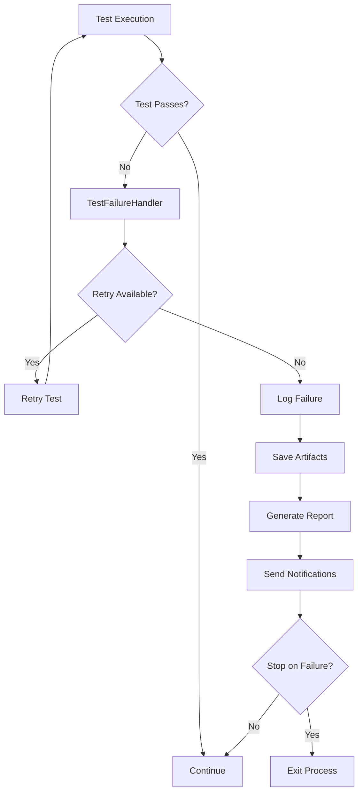

# Test Failure Handling Documentation

This document describes the comprehensive test failure handling system implemented for the Kiro Steering Loader extension.

## Overview

The test failure handling system provides:

- **Automatic retry mechanisms** for flaky tests
- **Detailed failure reporting** with context and artifacts
- **Notification systems** for CI/CD failures
- **Coverage quality gates** with configurable thresholds
- **Performance regression detection**
- **Memory leak detection and reporting**

## Architecture

### Components

1. **TestFailureHandler** - Core failure handling logic
2. **TestFailureReporter** - Generates detailed failure reports
3. **TestFailureNotifier** - Sends notifications on failures
4. **Failure Handling Configuration** - Centralized configuration
5. **CI/CD Integration** - GitHub Actions workflow integration

### Flow Diagram



## Configuration

### Environment-Based Configuration

The system adapts behavior based on the environment:

- **Development**: No retries, verbose output, no notifications
- **CI**: Retries enabled, fail-fast mode, notifications enabled
- **Production**: Maximum retries, critical tests only

### Test Type Configuration

Different test types have different failure handling:

- **Unit Tests**: 1 retry, 10s timeout, 85% coverage threshold
- **Integration Tests**: 2 retries, 30s timeout, 80% coverage threshold
- **E2E Tests**: 3 retries, 60s timeout, 70% coverage threshold
- **Performance Tests**: 2 retries, 120s timeout, performance thresholds
- **Memory Tests**: 1 retry, 60s timeout, memory leak detection

## Usage

### Basic Setup

```typescript
import { setupGlobalFailureHandling } from '../utils/failureHandler';

// Setup failure handling for unit tests
setupGlobalFailureHandling('unit');
```

### Custom Failure Handler

```typescript
import { createFailureHandler } from '../utils/failureHandler';

const handler = createFailureHandler('integration');

// Handle a test failure
await handler.handleFailure(
  'testName',
  'testFile.ts',
  new Error('Test failed'),
  1500 // duration in ms
);
```

### Configuration Override

```typescript
import { getTestTypeConfig } from '../config/failure-handling.config.js';

const config = getTestTypeConfig('e2e');
config.maxRetries = 5; // Override default
```

## Failure Reporting

### Report Structure

```json
{
  "timestamp": "2024-01-01T00:00:00.000Z",
  "summary": {
    "totalTests": 100,
    "passedTests": 95,
    "failedTests": 5,
    "skippedTests": 0
  },
  "failures": [
    {
      "suite": "unit",
      "failures": [
        {
          "testName": "should load template",
          "testFile": "steeringTemplateProvider.test.ts",
          "error": "Expected true but received false",
          "duration": 1500
        }
      ]
    }
  ],
  "coverage": {
    "lines": { "total": 1000, "covered": 850, "percentage": "85.00" },
    "functions": { "total": 100, "covered": 85, "percentage": "85.00" }
  },
  "performance": {
    "activationTime": 1200,
    "memoryUsage": 45
  }
}
```

### Report Formats

- **JSON**: Machine-readable format for CI/CD integration
- **Markdown**: Human-readable format for GitHub issues/PRs
- **HTML**: Rich format for detailed analysis

## Notification System

### GitHub Integration

- **Issues**: Automatically create issues for test failures
- **PR Comments**: Update pull request comments with test results
- **Status Checks**: Set commit status based on test results

### Slack Integration

```json
{
  "text": "🚨 Test failures detected in kiro-steering-loader",
  "blocks": [
    {
      "type": "section",
      "text": {
        "type": "mrkdwn",
        "text": "*Test Failures Detected*\n\nRepository: kiro-steering-loader\nBuild: #123\nFailed Tests: 5"
      }
    }
  ]
}
```

### Email Notifications

- **Recipients**: Configurable via environment variables
- **Content**: Detailed failure report with context
- **Attachments**: Test artifacts and logs

## CI/CD Integration

### GitHub Actions Workflow

```yaml
- name: Run tests with failure handling
  run: |
    npm run test:all || true
    
- name: Generate failure report
  if: always()
  run: npm run test:report
  
- name: Send notifications
  if: failure()
  run: npm run test:notify
```

### Quality Gates

- **Coverage Threshold**: Fail if coverage < 85%
- **Performance Regression**: Fail if performance degrades > 20%
- **Memory Leaks**: Fail if memory usage increases > 25%

## Artifacts and Debugging

### Saved Artifacts

- **Error Details**: JSON files with complete error information
- **Console Logs**: Captured output for failed tests
- **Memory Dumps**: Memory usage snapshots for performance tests
- **Screenshots**: For E2E test failures (when applicable)

### Artifact Structure

```
coverage/
├── artifacts/
│   ├── unit/
│   │   ├── test-name-error.json
│   │   ├── test-name-logs.txt
│   │   └── test-name-memory.json
│   ├── integration/
│   └── e2e/
├── test-failure-report-2024-01-01.json
├── test-failure-report-2024-01-01.md
└── github-issue-1234567890.md
```

## Best Practices

### Writing Resilient Tests

1. **Use proper timeouts**: Set appropriate timeouts for different test types
2. **Handle async operations**: Properly await async operations
3. **Clean up resources**: Always clean up after tests
4. **Use test isolation**: Ensure tests don't affect each other

### Debugging Failed Tests

1. **Check artifacts**: Review saved error details and logs
2. **Reproduce locally**: Use the same test data and conditions
3. **Enable debug mode**: Set `DEBUG_FAILED_TESTS=true`
4. **Use verbose logging**: Enable detailed logging for failed tests

### Configuration Guidelines

1. **Environment-specific**: Configure different settings per environment
2. **Test-type specific**: Adjust settings based on test complexity
3. **Performance considerations**: Balance retries vs. execution time
4. **Notification preferences**: Configure appropriate notification channels

## Troubleshooting

### Common Issues

#### Tests Failing Intermittently

- **Solution**: Increase retry count or improve test stability
- **Configuration**: Adjust `maxRetries` in test type config

#### Coverage Reports Not Generated

- **Solution**: Ensure coverage directory exists and is writable
- **Check**: Verify vitest coverage configuration

#### Notifications Not Sent

- **Solution**: Check environment variables for notification services
- **Debug**: Review notification logs in CI artifacts

#### Performance Tests Timing Out

- **Solution**: Increase timeout or optimize test performance
- **Configuration**: Adjust `testTimeout` for performance tests

### Debug Commands

```bash
# Run tests with debug output
DEBUG_FAILED_TESTS=true npm run test:unit

# Generate failure report manually
npm run test:report

# Send test notifications manually
npm run test:notify

# Run all tests with comprehensive reporting
npm run test:all:report
```

## Environment Variables

### Required Variables

- `NODE_ENV`: Test environment (test, development, production)
- `CI`: Indicates CI environment (true/false)

### Optional Variables

- `GITHUB_TOKEN`: GitHub API token for issue creation
- `SLACK_WEBHOOK_URL`: Slack webhook for notifications
- `TEST_FAILURE_EMAIL_RECIPIENTS`: Email addresses for notifications
- `DEBUG_FAILED_TESTS`: Enable debug mode for failed tests
- `KEEP_ALIVE_ON_FAILURE`: Keep test environment alive for debugging

### CI-Specific Variables

- `GITHUB_REPOSITORY`: Repository name for GitHub integration
- `GITHUB_RUN_ID`: CI run ID for linking
- `GITHUB_SHA`: Commit SHA for context
- `GITHUB_PR_NUMBER`: Pull request number for PR comments

## API Reference

### TestFailureHandler

```typescript
class TestFailureHandler {
  constructor(testType: 'unit' | 'integration' | 'e2e' | 'performance' | 'memory')
  
  async handleFailure(
    testName: string,
    testFile: string,
    error: Error,
    duration: number
  ): Promise<boolean>
  
  getFailureSummary(): FailureSummary
  async saveFailureReport(): Promise<string | null>
  reset(): void
  shouldSkipTest(testName: string, testFile: string): boolean
  setupHooks(): void
}
```

### TestFailureReporter

```typescript
class TestFailureReporter {
  loadTestResults(): void
  generateFailureReport(): FailureReport
  generateMarkdownReport(report: FailureReport): string
  saveReport(report: FailureReport, format: 'json' | 'markdown'): string
  run(): void
}
```

### TestFailureNotifier

```typescript
class TestFailureNotifier {
  async createGitHubIssue(report: FailureReport): Promise<void>
  async updatePullRequestComment(report: FailureReport): Promise<void>
  async sendSlackNotification(report: FailureReport): Promise<void>
  async sendEmailNotification(report: FailureReport): Promise<void>
  async run(): Promise<void>
}
```

## Contributing

When contributing to the test failure handling system:

1. **Follow TypeScript best practices**: Use proper typing and interfaces
2. **Add comprehensive tests**: Test the failure handling itself
3. **Update documentation**: Keep this documentation current
4. **Consider backward compatibility**: Don't break existing configurations
5. **Test across environments**: Verify behavior in dev, CI, and production

## License

This test failure handling system is part of the Kiro Steering Loader extension and follows the same MIT license.